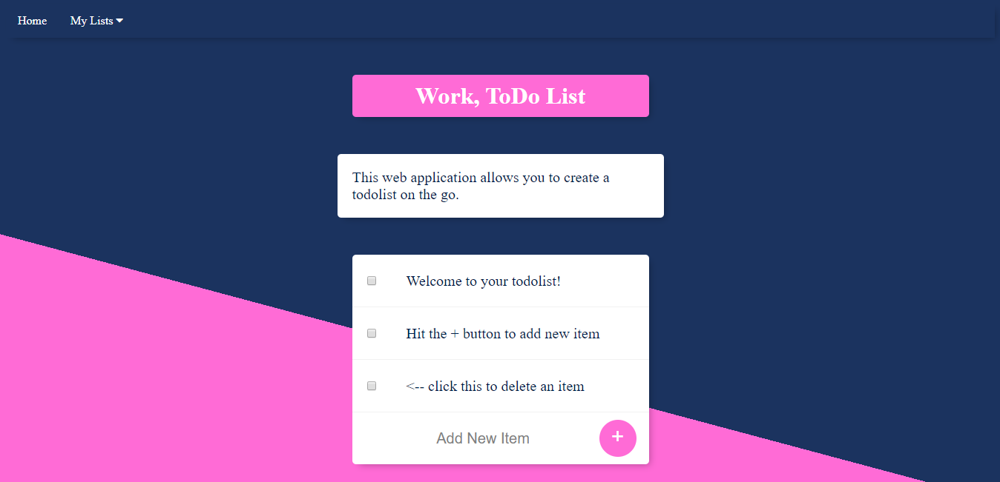

# Todo-List-Web-Application
This is a basic Todo list web application written with HTML, CSS, JavaScript, Nodejs, Express, and EJS templating.
How to use: 
Web application has predefined todo lists based on Home, Work, School. 

      
